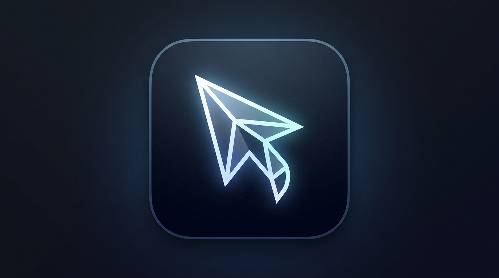

# Cursor Usage (macOS menu bar)

A small macOS menu bar app (Python + [rumps](https://github.com/jaredks/rumps)) that shows your Cursor usage the same way the in-app settings do: **total %**, **auto %**, **API %**, **on-demand spend**, plus **billing cycle renewal** (date and days left). It reads your session from Cursor’s local database and calls Cursor’s dashboard API over HTTPS.



## Disclaimer

This project is **not** affiliated with Cursor. It uses endpoints and local storage that match current Cursor behavior; those may change. Use at your own risk.

## Features

- Menu bar title: rounded **total usage %**
- Menu: total / auto / API %, on-demand dollars, **renews** (date + days left)
- Auto-refresh about every **5 minutes**; manual **Refresh** in the menu
- **LSUIElement** app (no Dock icon) when built with `build.sh`

## Requirements

- macOS (tested on recent macOS versions)
- Python 3.x (for building from source)
- Cursor installed and signed in

## Install from source

1. **Clone**

   ```bash
   git clone https://github.com/chrisstampar/cursor-usage.git
   cd cursor-usage
   ```

2. **Virtual environment & dependencies**

   ```bash
   python3 -m venv venv
   source venv/bin/activate
   pip install -r requirements.txt
   ```

3. **Build & install** (writes `dist/CursorUsage.app`, copies to `/Applications`, launches):

   ```bash
   chmod +x build.sh
   ./build.sh
   ```

## Run without installing

With `venv` activated:

```bash
python src/app.py
```

Quit from the menu or stop the process from Activity Monitor if you run it twice.

## Repository layout

```
├── README.md
├── LICENSE
├── SECURITY.md
├── CONTRIBUTING.md
├── requirements.txt
├── build.sh
├── setup.py
├── assets/
│   ├── icon.icns
│   └── icon.png
├── scripts/
│   └── convert_icon.py
└── src/
    └── app.py
```

## Privacy & security

- The app reads `cursorAuth/accessToken` from  
  `~/Library/Application Support/Cursor/User/globalStorage/state.vscdb` (read-only SQLite URI).
- It sends that token only to **https://api2.cursor.sh** (TLS verification on) for usage JSON.
- See [SECURITY.md](SECURITY.md) for how to report issues.

## License

MIT — see [LICENSE](LICENSE).
